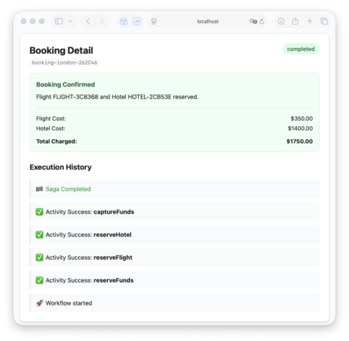

# DurableWorkflows

A research project exploring durable workflow patterns in Swift, built on top of [swift-distributed-actors](https://github.com/apple/swift-distributed-actors), [cluster-event-sourcing](https://github.com/akbashev/cluster-event-sourcing), and [cluster-virtual-actors](https://github.com/akbashev/cluster-virtual-actors).

The `Examples` directory contains a full working example with a web frontend:



The goal was to mimic the design of [swift-temporal-sdk](https://github.com/apple/swift-temporal-sdk) — workflows that survive process crashes and node restarts — but built on top of distributed actors. This was a few-days experiment, not a production system, so expect rough edges that a full Temporal deployment handles for you.

Each activity result is persisted before moving to the next step, so a workflow replays only the activities that haven't completed yet when it resumes.

## Comparison with `swift-temporal-sdk`

| | **DurableWorkflows** | **swift-temporal-sdk** |
|---|---|---|
| **Runtime** | Self-hosted, built on `swift-distributed-actors` | Requires a running Temporal server |
| **Storage** | Pluggable `EventStore` (file, Postgres, …) | Temporal's own persistence (Postgres/Cassandra) |
| **Workflow definition** | `@Workflow` | `@Workflow` |
| **Activity definition** | `@Activity` inside `@ActivityContainer` | `@Activity` inside `@ActivityContainer` |
| **Timers** | In-process: the workflow actor waits, journaled deadline | Server-side timer service; workflow evicted until fire time |
| **Maturity** | Research / showcase | Production-ready |

The core idea is the same — workflows are deterministic functions whose intermediate results are persisted — but DurableWorkflows is fully self-contained Swift with no external services required beyond an event store.

> [!TIP]
> One interesting side effect of building on `swift-distributed-actors`: distributed actors are `Codable` and `Sendable` by default, so you can pass them directly as activity inputs. This lets activities call back into actors to signal state — for example, notifying a `UserActor` of balance changes mid-workflow — without any extra plumbing.

## Concepts

**Workflow** — a plain Swift function that orchestrates activities. It must be deterministic: the same sequence of activity results always produces the same output. Defined with `@Workflow`.

**Activity** — a side-effectful unit of work (API call, DB write, payment charge). Defined with `@Activity` inside an `@ActivityContainer`. Activities are individually persisted and never re-executed on replay.

**WorkflowContext** — passed into `run(input:context:)`. Use it to execute activities (`context.executeActivity(...)`), sleep durably (`context.sleep(...)`), read deterministic time (`context.now`), and resolve distributed actors (`context.getActor(...)`).

**Event store** — pluggable persistence for workflow and activity events. Swap between file-based (dev) and Postgres (production) without changing any workflow code.

## Requirements

- Swift 6.2+
- macOS 26+

## Installation

The package currently lives in the [distributed-actors-showcase](https://github.com/akbashev/distributed-actors-showcase) monorepo. Clone it and use a local path dependency:

```swift
// Package.swift
dependencies: [
    .package(path: "../distributed-actors-showcase/durable-workflows"),
],
targets: [
    .target(
        name: "MyTarget",
        dependencies: [
            .product(name: "DurableWorkflows", package: "durable-workflows"),
        ]
    ),
]
```

## Usage

### 1. Define activities

```swift
import DurableWorkflows

@ActivityContainer
struct OrderActivities {
    @Activity
    func chargePayment(input: ChargeRequest, context: ActivityContext) async throws -> String {
        // call payment API — result is persisted, never retried on replay
        return try await paymentGateway.charge(input.amountCents)
    }

    @Activity
    func sendConfirmation(input: SendRequest, context: ActivityContext) async throws {
        try await emailService.send(to: input.email, body: "Order confirmed!")
    }
}
```

### 2. Define the workflow

```swift
@Workflow
struct OrderWorkflow {
    typealias Activities = OrderActivities

    struct Input: Codable, Sendable { let orderId: String; let email: String; let amountCents: Int }
    struct Output: Codable, Sendable { let chargeId: String }

    func run(input: Input, context: WorkflowContext) async throws -> Output {
        let chargeId = try await context.executeActivity(
            OrderActivities.Activities.ChargePayment.self,
            input: .init(amountCents: input.amountCents)
        )
        try await context.executeActivity(
            OrderActivities.Activities.SendConfirmation.self,
            input: .init(email: input.email)
        )
        return Output(chargeId: chargeId)
    }
}
```

### 3. Register the plugin and run

```swift
import DurableWorkflows
import EventSourcing

let store: any EventStore = MyEventStore()

let system = await ClusterSystem("my-app") {
    $0.plugins.install(plugin: ClusterSingletonPlugin())
    $0.plugins.install(plugin: ClusterVirtualActorsPlugin())
    $0.plugins.install(plugin: ClusterJournalPlugin { _ in store })
    $0.plugins.install(plugin: DurableWorkflowsPlugin())
}

// Start a worker that executes activities
let worker = await DurableActivityDispatchWorker<OrderWorkflow>(actorSystem: system)
```

### 4. Execute a workflow

```swift
let output = try await system.workflows.execute(
    type: OrderWorkflow.self,
    options: WorkflowOptions(id: "order-\(orderId)"),
    input: .init(orderId: orderId, email: email, amountCents: 9900)
)
print(output.chargeId)
```

### Status

```swift
let info = try await system.workflows.getStatus(type: OrderWorkflow.self, options: options)
print(info.status)  // .idle / .running / .completed(data:) / .cancelled / .failed(error:)
print(info.events)  // full activity history
```

### Cancellation

Cancellation stops the current execution task and persists a `.cancelled` status, so the workflow will not resume on restart.

```swift
try await system.workflows.cancel(type: OrderWorkflow.self, options: options)
```

To handle cancellation gracefully inside the workflow, wrap the compensation logic in a detached `Task` — cancellation propagates through Swift's structured concurrency, so any `try await` inside `run` will throw `CancellationError`:

```swift
func run(input: Input, context: WorkflowContext) async throws -> Output {
    var reservationId: String?

    do {
        reservationId = try await context.executeActivity(ReserveSpot.self, input: input)
        // ... more activities
    } catch {
        // CancellationError or activity failure — compensate
        let task = Task {
            if let id = reservationId {
                try? await context.executeActivity(CancelSpot.self, input: .init(id: id))
            }
            throw error
        }
        return try await task.value
    }
}
```

## Timers and deterministic time

Workflows can sleep durably — the timer survives crashes and restarts:

```swift
func run(input: Input, context: WorkflowContext) async throws -> Output {
    try await context.executeActivity(ChargeCustomer.self, input: input)

    // Three overloads, one mechanism:
    try await context.sleep(for: .days(30))                    // Duration
    try await context.sleep(until: .now + .days(30))           // ContinuousClock.Instant
    try await context.sleep(until: subscription.renewsAt)      // Date — for deadlines from the outside world

    let now = try await context.now  // deterministic workflow time (ContinuousClock.Instant)

    let result = try await context.timeout(for: .seconds(30)) {
        try await someOperation()
    }
}
```

A `sleep` journals `timerScheduled` with an **absolute wall-clock deadline** before waiting, and `timerFired` after. On recovery, the replayed run binds to the recorded timer by sequence number and waits only the *remaining* time — a 30-day timer that crashes on day 29 sleeps one more day, not thirty. `Date` appears only at the storage boundary; the wait itself runs on `ContinuousClock`.

Rules worth knowing:

- **`summary` is metadata, not identity.** Timers bind by per-run sequence number, allocated in call order and shared with `now`. Sequential sleeps replay deterministically; concurrent sleeps (task groups) are numbered in arrival order and may swap across replays — keep timers sequential for now.
- **The `Date` overload is value-validated on replay.** The date should come from journaled state (input, activity results). If changed workflow code passes a different date than history recorded, the run fails with `nondeterministicDeadline` instead of silently waking at the old deadline — the same fail-loudly contract activities have. The `Instant`/`Duration` overloads can't be validated this way (per-boot values aren't reproducible).
- **Cancelling a sleeping task journals `timerCancelled`** so replay rethrows instead of recreating the sleep.

## Design notes vs. Temporal

Temporal never sleeps on the worker: `sleep` emits a command, and a **server-side timer service** owns the deadline — the workflow can stay evicted for weeks and gets rehydrated when the server fires the timer. Our model is simpler: the workflow actor itself waits (on `ContinuousClock`), held resident in memory by `shouldDeactivate` refusing to passivate a running workflow, and recovered by journal replay if the node restarts.

Trade-offs of the simple model:

- **Pro:** no separate scheduler component, no extra infrastructure; timer correctness falls out of the same journal replay everything else uses.
- **Con:** a workflow on a 30-day timer keeps its actor resident in memory for 30 days. Fine at showcase scale; a fleet of long-sleeping workflows would want the Temporal-style split.
- **Con:** the live wait is monotonic while the journaled deadline is wall-clock, so a wall-clock step (NTP jump) during an uninterrupted wait is only noticed at the next resume.

## Next steps

Things deliberately not built yet, in rough priority order:

1. **Scheduler/timer service actor** — scan journaled `timerScheduled` deadlines and wake workflows at fire time, Temporal-style. Unlocks evicting long-sleeping workflows from memory. Only worth it if timer volume justifies it.
2. **Node-down timer recovery** — when a cluster member leaves for good, nothing re-homes its pending timers today (`recoverAll` covers node *restart*). Needs a scan-on-member-down plus a slow periodic sweep; folds into the planned Raft work in `distributed-actors` (split-brain safety is a prerequisite — two nodes must never resume the same timer).
3. **Deterministic executor for concurrent sleeps** — sequence allocation across task groups is arrival-order today; full Temporal semantics need deterministic scheduling or a richer command-history model.
4. **Cancellation shielding** (`withCancellationShield`-style) for compensation blocks — Temporal has it; our README workaround is a detached `Task`.

## Durability

If the process crashes mid-workflow, the next call to `execute` or `resume` replays the workflow from the persisted event log. Completed activities are served from cache — their side effects do **not** run again. Only the next pending activity is dispatched to a worker.

## License

Apache 2.0 — see [LICENSE.txt](LICENSE.txt).
